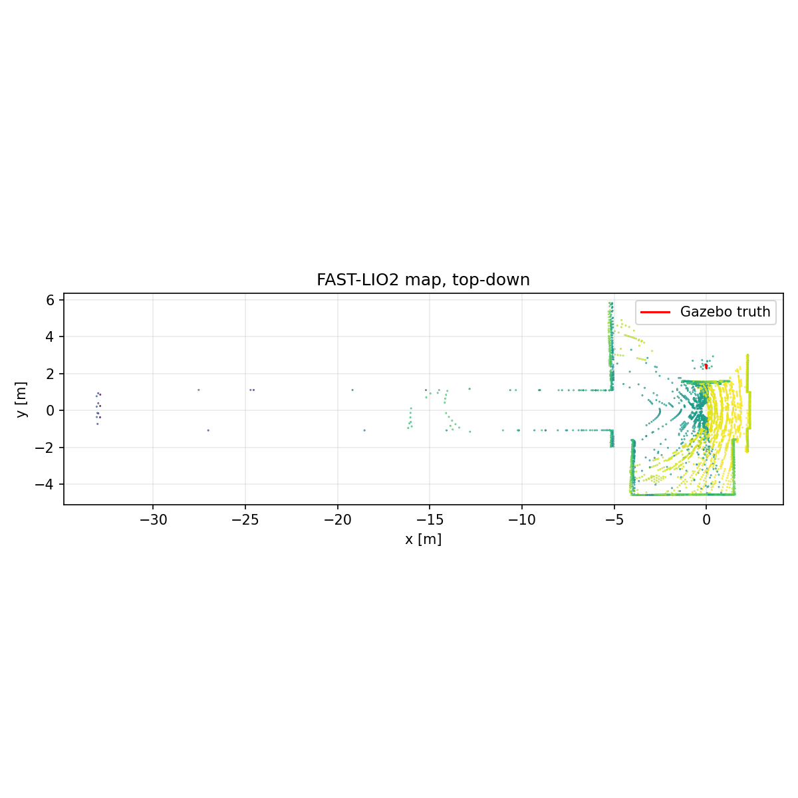
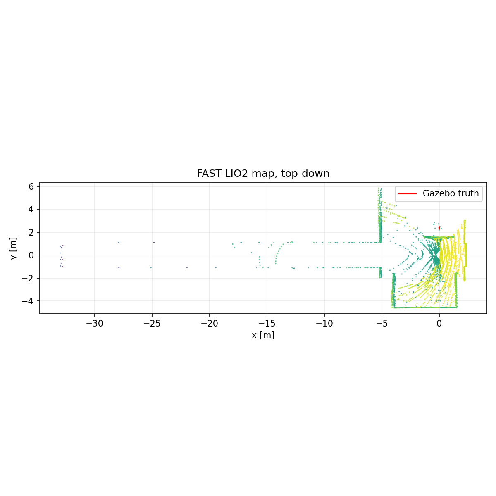

# Task Report: Trotting/RL 单层运动建图

## Branch

`exp/0717-trot-rl-floor-mapping`，基线 `818ee58e`。

## Summary

结论为 **PARTIAL**。在 `FLOOR_COUNT=1`、`SEED=77`、相同出生位姿和相同 1.75 s ROS-time
路线下，Trotting（FSM 4）与 RL（FSM 6）均能通过 `/cmd_vel` 产生有限运动，
并持续驱动 FAST-LIO2 输出里程计和注册点云。两轮均为全新 Gazebo/ROS epoch，
使用系统 Python 3.10，且分别受 240 s 采集和 480 s 会话墙钟硬超时保护。
运动与局部建图链路通过，但短路线没有完成整层覆盖，地图质量也存在远端离群风险。

## Results

| 指标 | Trotting | RL |
|---|---:|---:|
| 墙钟时长 | 30.204 s | 32.112 s |
| Gazebo 真值位移 | 0.192487 m | 0.169675 m |
| 最小 base z | 0.092189 m | 0.096833 m |
| 最大倾角 | 6.497° | 6.673° |
| 停止尾段平均平面速度 | 0.007076 m/s | 0.024517 m/s |
| `/Odometry` 样本 | 53 | 50 |
| `/cloud_registered` 帧 | 53 | 50 |
| 保存地图点 | 5,006 | 5,048 |
| 点云 x 范围 | [-33.069, 2.378] m | [-33.018, 2.363] m |
| 点云 y 范围 | [-4.590, 5.827] m | [-4.592, 5.836] m |
| x < -10 m 离群点 | 50 (0.999%) | 56 (1.109%) |
| truth / odom 有限值 | PASS | PASS |

Trotting 的停止趋势较好；RL 在短停止观察窗内仍有 0.0245 m/s 残余速度，
因此 RL “能移动与建图”通过，但精确停止性能仍需更长窗口验证。两轮最大倾角
均小于 7°，未观察到翻倒或 NaN。

## Map Evidence

短试验期间 `/Laser_map` 未发布，按测试计划使用最后一帧
`/cloud_registered` 生成 PCD 与俯视投影。主要近场墙面轮廓可辨，但 x≈-15 m
及 x≈-33 m 存在离群回波。剔除 x < -10 m 的疑似离群后，Trotting 主云 x
范围为 [-9.335, 2.378] m，RL 为 [-9.605, 2.363] m。该图仅证明
`/cmd_vel` 运动与局部建图链路，不代表已完成全层覆盖，也不能视为完整楼层
mapping PASS。

### Trotting

原始证据：`trotting/map_ascii.pcd`、`ground_truth.csv`、`odometry.csv`、
`trial_metrics.json`。

### RL

原始证据：`rl/map_ascii.pcd`、`ground_truth.csv`、`odometry.csv`、
`trial_metrics.json`。

## Files Changed

- `auto.sh`: 新增 opt-in 跳过全局进程清理，并强制 scan adapter 使用系统 Python。
- `experiments/runs/0717_trot-rl-floor-mapping/`: Issue、可复现 runner、采集器、
  有界点云回归、CSV、PCD、PNG、指标与日志。
- `PROJECT_STATE.md`: 记录本次运行状态和残余风险。

## Tests

- `/usr/bin/python3 -m py_compile`：采集器与离线点云测试通过。
- `bash -n auto.sh run_mapping_trial.sh`：通过。
- 250,000 点合成 PointCloud2：最多保存 50,000 点，最终 preflight 2.54 s。
- Torch-enabled 独立目标构建：`junior_ctrl`、FAST-LIO2、Livox 与 Unitree
  控制/插件目标通过。
- 两次 headless 新仿真：Trotting、RL 路线与地图证据均完成。

完整 `catkin_make -j2` 被无关 UAV `map_generator` 的既有 C++ 标准冲突阻断；
本任务所需目标均单独构建成功。

## Git

提交与合并信息在提交后补充到最终交付；本分支不推送、不删除。

## Risks

- 路线为快速、安全冒烟测试，不是完整楼层覆盖。
- 注册点云有远距离离群点；需更长轨迹、滤波与闭环测试评价地图质量。
- RL 停止残余速度高于 Trotting，需延长停止窗口并调试策略命令响应。
- `SKIP_GLOBAL_PROCESS_CLEANUP` 默认关闭；并行运行时仍必须使用外部锁和独立清理。

## Next Step

在集成分支复用本 runner 做更长的单层覆盖路线，延长 RL 停止观察，并在
合并 Stage 2 适配后重复 `/state_estimation` 与 `/registered_scan` 端到端验证。
