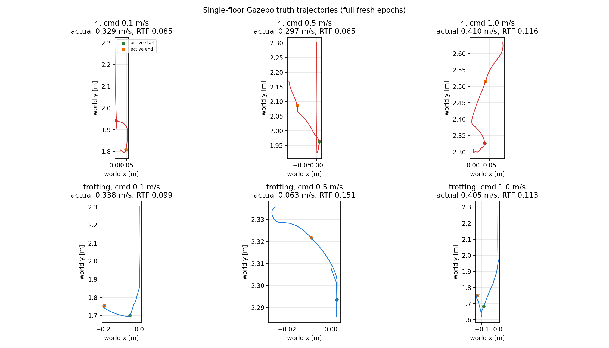
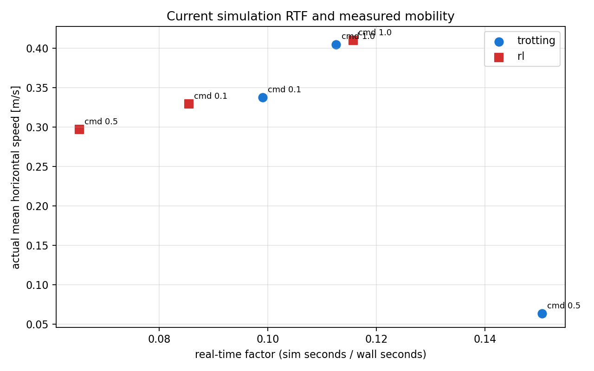

# 单层 Trotting / RL 速度性能测试

日期：2026-07-17
分支：`exp/0717-trot-rl-speed-profile`
结论：**完成六组短时响应测试；不能将结果当作稳态速度标定。**

## 目的与方法

在固定 `FLOOR_COUNT=1`、`SEED=77`、出生位姿 `(0, 2.3, 0.6, yaw=1.5708)`
的 headless Gazebo 场景中，分别向 `/fsm/state_cmd` 发送 `4`（Trotting）或
`6`（RL），并向 `/cmd_vel` 发送前向 `geometry_msgs/Twist`。每个速度点都从全新
ROS master、全新 Gazebo 和全新控制器 epoch 启动；端口为 11410--11700，运行器以
`/tmp/simenv-gazebo.lock` 串行化。

每轮先请求 FixedStand，再切换目标状态；测量窗口为 0.5 s ROS 仿真时间，随后发送
0.25 s 零速度。为使低实时因子场景仍能保存失败证据，每个控制段最多等待 10 s
墙钟时间。轨迹和速度均由 `/gazebo/model_states` 中 `a1_gazebo` 的真值计算，
`RTF = ROS 仿真时间 / 墙钟时间`。

## 结果

| 状态 | 指令 (m/s) | RTF | 实际均速 (m/s) | 后半窗均速 (m/s) | 跟踪比 | 停止尾速 (m/s) |
|---|---:|---:|---:|---:|---:|---:|
| Trotting | 0.1 | 0.099 | 0.338 | 0.094 | 3.376 | 0.037 |
| Trotting | 0.5 | 0.151 | 0.063 | 0.106 | 0.127 | 0.037 |
| Trotting | 1.0 | 0.113 | 0.405 | 0.514 | 0.405 | 0.066 |
| RL | 0.1 | 0.085 | 0.329 | 0.416 | 3.295 | 0.019 |
| RL | 0.5 | 0.065 | 0.297 | 0.394 | 0.594 | 0.288 |
| RL | 1.0 | 0.116 | 0.410 | 0.569 | 0.410 | 0.328 |

“后半窗均速”减少入状态瞬态的影响；“停止尾速”是零命令段最后三分之一的水平真值
速度。全部六轮均产生有限值真值，并完成所配置的仿真时间窗口。

## RTF 与移动能力

本次 RTF 为 **0.065--0.151**，即 0.5 s 仿真控制窗口通常消耗约 3.3--7.7 s 墙钟。
六个点未显示单调的“RTF 越高、实际速度越高”关系：例如 Trotting 0.5 m/s 的 RTF
最高（0.151）而实际均速最低（0.063 m/s）；RL 0.5 m/s 的 RTF 最低（0.065）且实际
均速为 0.297 m/s。这说明在该小样本、短窗实验中，当前状态机/策略瞬态、接触和姿态
效应比 RTF 更直接地决定移动结果；RTF 主要决定完成同一仿真时长所需的墙钟时间。

两种状态均未在所有指令点实现比例速度跟踪。低指令（0.1 m/s）出现明显超调，而
0.5/1.0 m/s 的实际均速约受限于 0.06--0.41 m/s。RL 的 0.5/1.0 m/s 零命令尾速仍为
0.288/0.328 m/s，停止能力是当前最突出的风险；Trotting 三轮尾速较低（0.037--0.066
m/s），但其速度响应也不单调。

## 证据与复现

- 汇总：`experiments/runs/0717_trot-rl-speed-profile/summary.csv`、`summary.json`。
- 每轮：`raw/<tag>/ground_truth.csv`、`trial_metrics.json`、`auto.log`、`capture.log`。
- 绘图：`plot_speed_profile.py`；执行 `/usr/bin/python3 plot_speed_profile.py`。
- 运行器：`run_speed_trial.sh` 为每轮分配独立 ROS master，且只在上一轮端口退出后继续；
  `run_all.sh` 可用于串行复跑。复跑前须将 `SIMENV_BINARY_DEVEL` 指向已验证的
  Torch-enabled `devel` 目录。

## 限制、风险与下一步

- 0.5 s 是短时响应窗口，不足以声明稳态最高速度、整层导航能力或控制安全认证。
- 高绝对 yaw 与低 base-z 样本需要单独的姿态/跌倒门限回归；本报告仅陈述有限值和
  真值移动，不把它们误报为“未跌倒”。
- 应在控制器完成稳定起步后扩展至至少 3--5 s ROS 时间，分别记录 body-frame 速度、
  姿态、接触和停止收敛；RL 应优先处理高速度点的残余运动。
- 本 worktree 的完整 `catkin_make -j2` 配置未通过：CUDA 11.8 的 `nvcc` 调用宿主
  编译器时找不到 `cc1plus`。实验使用既有、已验证的 Torch-enabled 二进制覆盖层；
  Python/shell 静态检查和六组 headless 运行均通过。
